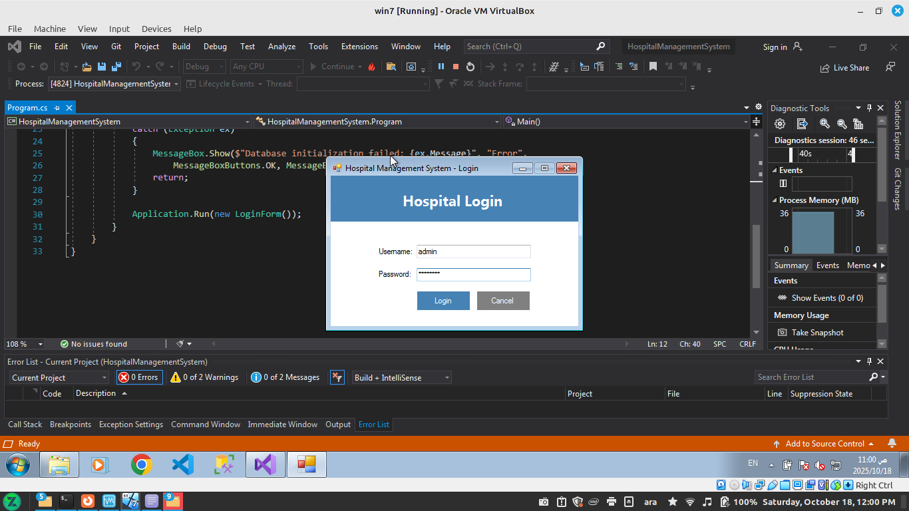
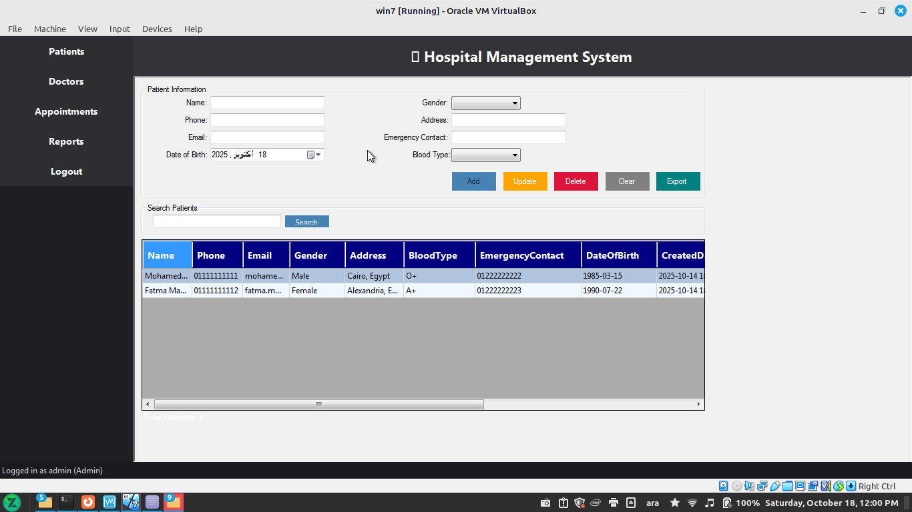
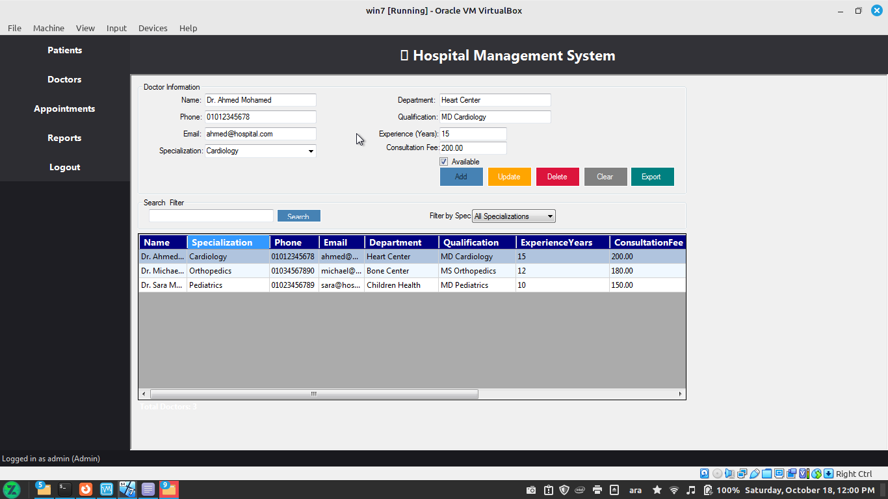
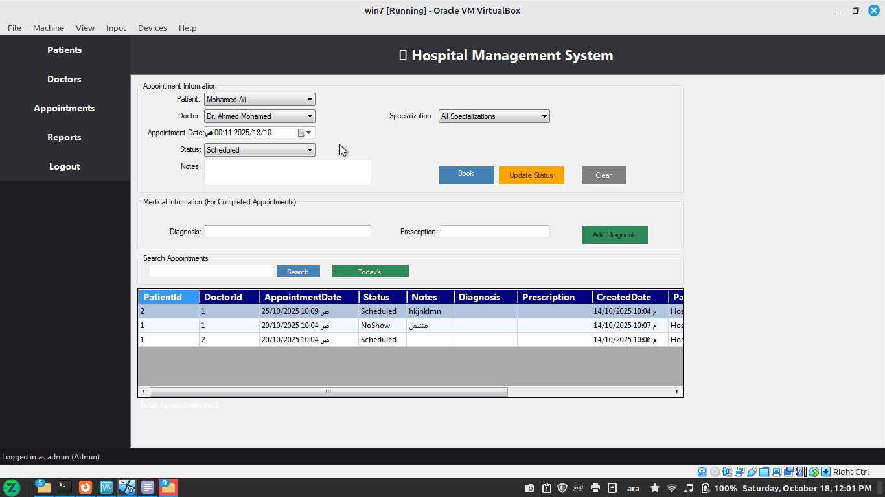
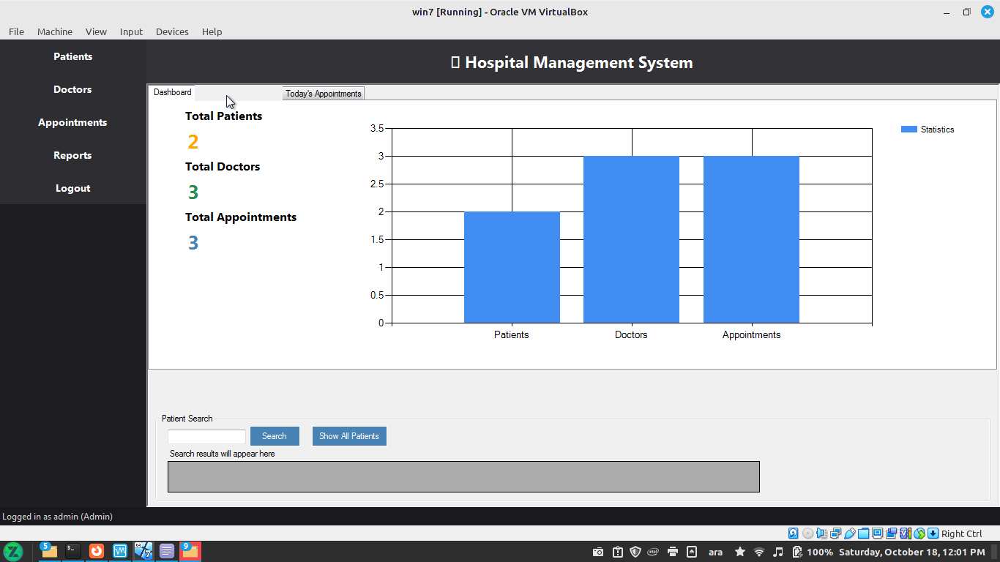

# 🏥 Hospital Management System

A **Windows Forms** application built with **C#** and **Entity Framework** to streamline hospital operations including patient, doctor, and appointment management.

> 💡 This project was developed as the **final project for the Windows Forms module** in the **ITI Intensive .NET Program**.

---

## 🚀 Features

- 🔐 **User Authentication** — Secure login with role-based access (Admin, Doctor, Receptionist)
- 👨‍⚕️ **Patient Management** — Add, view, update, and delete patient records
- 🩺 **Doctor Management** — Manage doctor information, departments, and availability
- 📅 **Appointment Scheduling** — Book, view, and update patient appointments
- 🔎 **Smart Search** — Quickly find patients by name, phone, or email
- 📊 **Reporting & Analytics** — View today’s appointments and performance charts
- 📤 **Data Export** — Export appointment data to CSV
- 🗄️ **Database Integration** — Code-first approach with Entity Framework and SQL Server

---

## 🧑‍💻 Development Team

| Developer | Responsibility |
|------------|----------------|
| **Mohamed Yassin** | Authentication & Core Application Structure |
| **Abdallah Farrag** | Patient Management Module |
| **Abanoub Milad** | Doctor & Appointment Management |
| **Ziad Safwat** | Search & Reporting Features |

---

## 🖼️ Application Preview

| Login Screen | Patient Management | Doctor Page |
|:-------------:|:------------------:|:------------:|
|  |  |  |

| Appointments | Reporting |
|:-------------:|:-----------:|
|  |  |

---

## 👥 Roles & Access

| Role | Access Level |
|------|---------------|
| **Administrator** | Full access to all modules and reports |
| **Doctor** | Access to appointments, patients, and medical records |
| **Receptionist** | Manage patient registration and appointments |

**Default Login Credentials:**

| Role | Username | Password |
|------|-----------|-----------|
| Admin | `admin` | `admin123` |
| Doctor | `doctor` | `doctor123` |
| Reception | `reception` | `reception123` |

---

## 🧰 Technology Stack

| Category | Technology |
|-----------|-------------|
| **Language** | C# |
| **Framework** | .NET Windows Forms |
| **ORM** | Entity Framework |
| **Database** | SQL Server / LocalDB |
| **Architecture** | Multi-Document Interface (MDI) |
| **Reporting** |  charts and statistics views |

---

## 🗄️ Database Setup

### ⚙️ Option 1: Automatic Setup (Recommended)
The database will be **automatically created** using **Entity Framework Code-First** on the first run.

### 🧩 Option 2: Manual SQL Script Setup
Run the provided SQL script in **SQL Server Management Studio** or **Azure Data Studio**.

<details>
<summary>📜 Click to view full SQL script</summary>

```sql
-- Create Database
CREATE DATABASE HospitalManagementSystem;
GO

USE HospitalManagementSystem;
GO

-- Users Table for Authentication
CREATE TABLE Users (
    Id INT IDENTITY(1,1) PRIMARY KEY,
    Username NVARCHAR(50) NOT NULL UNIQUE,
    Password NVARCHAR(255) NOT NULL,
    Role NVARCHAR(20) NOT NULL CHECK (Role IN ('Admin', 'Doctor', 'Reception')),
    CreatedDate DATETIME2 DEFAULT GETDATE(),
    IsActive BIT DEFAULT 1
);
GO

-- Patients Table
CREATE TABLE Patients (
    Id INT IDENTITY(1,1) PRIMARY KEY,
    Name NVARCHAR(100) NOT NULL,
    Phone NVARCHAR(20) NOT NULL,
    Email NVARCHAR(100),
    DateOfBirth DATE NOT NULL,
    Gender NVARCHAR(10) CHECK (Gender IN ('Male', 'Female', 'Other')),
    Address NVARCHAR(255),
    EmergencyContact NVARCHAR(100),
    BloodType NVARCHAR(5),
    CreatedDate DATETIME2 DEFAULT GETDATE(),
    LastUpdated DATETIME2 DEFAULT GETDATE()
);
GO

-- Doctors Table
CREATE TABLE Doctors (
    Id INT IDENTITY(1,1) PRIMARY KEY,
    Name NVARCHAR(100) NOT NULL,
    Specialization NVARCHAR(100) NOT NULL,
    Phone NVARCHAR(20) NOT NULL,
    Email NVARCHAR(100),
    Department NVARCHAR(100),
    Qualification NVARCHAR(100),
    ExperienceYears INT,
    ConsultationFee DECIMAL(10,2),
    IsAvailable BIT DEFAULT 1,
    CreatedDate DATETIME2 DEFAULT GETDATE()
);
GO

-- Appointments Table
CREATE TABLE Appointments (
    Id INT IDENTITY(1,1) PRIMARY KEY,
    PatientId INT NOT NULL,
    DoctorId INT NOT NULL,
    AppointmentDate DATETIME2 NOT NULL,
    Status NVARCHAR(20) DEFAULT 'Scheduled' CHECK (Status IN ('Scheduled', 'Completed', 'Cancelled', 'NoShow')),
    Notes NTEXT,
    Diagnosis NTEXT,
    Prescription NTEXT,
    CreatedDate DATETIME2 DEFAULT GETDATE(),
    
    FOREIGN KEY (PatientId) REFERENCES Patients(Id) ON DELETE CASCADE,
    FOREIGN KEY (DoctorId) REFERENCES Doctors(Id) ON DELETE CASCADE
);
GO

-- Medical Records Table
CREATE TABLE MedicalRecords (
    Id INT IDENTITY(1,1) PRIMARY KEY,
    PatientId INT NOT NULL,
    DoctorId INT NOT NULL,
    RecordDate DATETIME2 DEFAULT GETDATE(),
    Symptoms NTEXT,
    Diagnosis NTEXT,
    Treatment NTEXT,
    Prescription NTEXT,
    Notes NTEXT,
    
    FOREIGN KEY (PatientId) REFERENCES Patients(Id) ON DELETE CASCADE,
    FOREIGN KEY (DoctorId) REFERENCES Doctors(Id) ON DELETE CASCADE
);
GO

-- Insert Default Users
INSERT INTO Users (Username, Password, Role) VALUES
('admin', 'admin123', 'Admin'),
('doctor', 'doctor123', 'Doctor'),
('reception', 'reception123', 'Reception');
GO

-- Insert Sample Doctors
INSERT INTO Doctors (Name, Specialization, Phone, Email, Department, Qualification, ExperienceYears, ConsultationFee) VALUES
('Dr. Ahmed Mohamed', 'Cardiology', '01012345678', 'ahmed.m@hospital.com', 'Heart Center', 'MD Cardiology', 15, 200.00),
('Dr. Sara Mahmoud', 'Pediatrics', '01023456789', 'sara.m@hospital.com', 'Children Health', 'MD Pediatrics', 10, 150.00),
('Dr. Michael Nabil', 'Orthopedics', '01034567890', 'michael.n@hospital.com', 'Bone Center', 'MS Orthopedics', 12, 180.00),
('Dr. Layla Hassan', 'Dermatology', '01045678901', 'layla.h@hospital.com', 'Skin Care', 'MD Dermatology', 8, 120.00);
GO

-- Insert Sample Patients
INSERT INTO Patients (Name, Phone, Email, DateOfBirth, Gender, Address, EmergencyContact, BloodType) VALUES
('Mohamed Ali', '01111111111', 'mohamed.ali@email.com', '1985-03-15', 'Male', 'Cairo, Egypt', '01222222222', 'O+'),
('Fatma Mahmoud', '01111111112', 'fatma.m@email.com', '1990-07-22', 'Female', 'Alexandria, Egypt', '01222222223', 'A+'),
('Omar Said', '01111111113', 'omar.s@email.com', '1978-11-30', 'Male', 'Giza, Egypt', '01222222224', 'B+'),
('Aisha Mostafa', '01111111114', 'aisha.m@email.com', '1995-05-10', 'Female', 'Luxor, Egypt', '01222222225', 'AB+');
GO

-- Insert Sample Appointments
INSERT INTO Appointments (PatientId, DoctorId, AppointmentDate, Status, Notes) VALUES
(1, 1, '2024-01-15 10:00:00', 'Completed', 'Regular heart checkup'),
(2, 2, '2024-01-15 11:30:00', 'Scheduled', 'Child vaccination'),
(3, 3, '2024-01-16 09:00:00', 'Scheduled', 'Knee pain consultation'),
(4, 4, '2024-01-16 14:00:00', 'Scheduled', 'Skin allergy check');
GO

-- Insert Sample Medical Records
INSERT INTO MedicalRecords (PatientId, DoctorId, Symptoms, Diagnosis, Treatment, Prescription) VALUES
(1, 1, 'Chest pain, shortness of breath', 'Mild hypertension', 'Lifestyle changes, regular monitoring', 'Aspirin 100mg daily'),
(2, 2, 'Fever, cough', 'Common cold', 'Rest and hydration', 'Paracetamol 500mg as needed');
GO

-- Create Useful Views
CREATE VIEW vw_AppointmentDetails AS
SELECT 
    a.Id,
    a.AppointmentDate,
    p.Name AS PatientName,
    p.Phone AS PatientPhone,
    d.Name AS DoctorName,
    d.Specialization,
    a.Status,
    a.Notes
FROM Appointments a
INNER JOIN Patients p ON a.PatientId = p.Id
INNER JOIN Doctors d ON a.DoctorId = d.Id;
GO

CREATE VIEW vw_DoctorAppointments AS
SELECT 
    d.Name AS DoctorName,
    d.Specialization,
    a.AppointmentDate,
    p.Name AS PatientName,
    a.Status
FROM Doctors d
INNER JOIN Appointments a ON d.Id = a.DoctorId
INNER JOIN Patients p ON a.PatientId = p.Id;
GO

CREATE VIEW vw_PatientMedicalHistory AS
SELECT 
    p.Name AS PatientName,
    p.Phone,
    p.DateOfBirth,
    mr.RecordDate,
    d.Name AS DoctorName,
    mr.Diagnosis,
    mr.Treatment
FROM Patients p
INNER JOIN MedicalRecords mr ON p.Id = mr.PatientId
INNER JOIN Doctors d ON mr.DoctorId = d.Id;
GO

-- Create Stored Procedures
CREATE PROCEDURE sp_GetTodaysAppointments
AS
BEGIN
    SELECT * FROM vw_AppointmentDetails 
    WHERE CAST(AppointmentDate AS DATE) = CAST(GETDATE() AS DATE)
    ORDER BY AppointmentDate;
END;
GO

CREATE PROCEDURE sp_SearchPatients
    @SearchTerm NVARCHAR(100)
AS
BEGIN
    SELECT * FROM Patients 
    WHERE Name LIKE '%' + @SearchTerm + '%' 
       OR Phone LIKE '%' + @SearchTerm + '%'
       OR Email LIKE '%' + @SearchTerm + '%';
END;
GO

CREATE PROCEDURE sp_GetDoctorSchedule
    @DoctorId INT,
    @Date DATE
AS
BEGIN
    SELECT * FROM Appointments 
    WHERE DoctorId = @DoctorId 
    AND CAST(AppointmentDate AS DATE) = @Date
    ORDER BY AppointmentDate;
END;
GO

-- Create Indexes for Performance
CREATE INDEX IX_Appointments_Date ON Appointments(AppointmentDate);
CREATE INDEX IX_Appointments_Status ON Appointments(Status);
CREATE INDEX IX_Patients_Name ON Patients(Name);
CREATE INDEX IX_Patients_Phone ON Patients(Phone);
CREATE INDEX IX_Doctors_Specialization ON Doctors(Specialization);
GO

-- Display Database Summary
SELECT 
    (SELECT COUNT(*) FROM Users) AS TotalUsers,
    (SELECT COUNT(*) FROM Patients) AS TotalPatients,
    (SELECT COUNT(*) FROM Doctors) AS TotalDoctors,
    (SELECT COUNT(*) FROM Appointments) AS TotalAppointments;
GO
```
</details>

---

## ⚙️ Database Configuration

Update your **App.config** file with your SQL Server credentials:

```xml
<configuration>
  <connectionStrings>
    <add name="HospitalDbContext" 
         connectionString="Server=YOUR_SERVER_NAME;Database=HospitalManagementSystem;Integrated Security=True;TrustServerCertificate=True;" 
         providerName="System.Data.SqlClient" />
  </connectionStrings>
</configuration>
```

**Examples:**

- **Local SQL Server:**
```xml
<add name="HospitalDbContext" 
     connectionString="Server=localhost;Database=HospitalManagementSystem;Integrated Security=True;TrustServerCertificate=True;" 
     providerName="System.Data.SqlClient" />
```

- **Remote SQL Server:**
```xml
<add name="HospitalDbContext" 
     connectionString="Server=192.168.1.10,1433;Database=HospitalManagementSystem;User Id=sa;Password=YourPassword;TrustServerCertificate=True;" 
     providerName="System.Data.SqlClient" />
```

---

## 🖱️ Usage

1. **Login** using default credentials  
2. **Manage Patients** — Add, update, or delete patient records  
3. **Manage Doctors** — Track doctor information and specialties  
4. **Schedule Appointments** — Connect patients and doctors with appointment scheduling  
5. **Generate Reports** — View statistics and daily appointment summaries  
6. **Export Data** — Export data tables to CSV format for offline use  

---

## 🧾 License

This project is licensed under the **MIT License**.  
Developed as part of the **ITI Intensive .NET Program**.  
See the [LICENSE](LICENSE) file for details.

